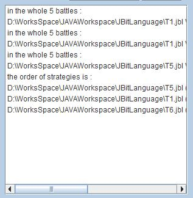

# Bit-Battles
编译原理项目 比特大战

## 项目描述

- 一个**N回合的比特大战**由A和B双方进行
- 每个回合A和B可以选择 0（背叛）或 1（合作），共进行N个回合
- 如果第 n （1 <= n <= N）个回合A和B的选择分别为An和Bn ，则他们在这个回合的得分SA（n）和SB（n）由下表决定：

  |         |         Bn = 0          |          Bn = 1         |
  |---------|-------------------------|-------------------------|
  |  An = 0 | SA（n）= 1，SB（n）= 1  | SA（n）= 5，SB（n）= 0  |
  |  An = 1 | SA（n）= 0，SB（n）= 5  | SA（n）= 3，SB（n）= 3  |
  
- A和B的总分为N个回合各自得分的和


## 游戏的策略

对于N个回合的比特大战，每回合的得分可能是0,1,3,5，因此总分总是在0和5N之间。双方**不同的策略**可能导致不同的得分。


以下是一些可能的策略：

- （T1）**永远合作**，每次都选择1
- （T2）**随机**，每次以某个概率随机选择1，否则选择0
- （T3）**针锋相对**，先选择1，以后每次都选择对方的上一次选择
- （T4）**老实人探测器**，基本上和**针锋相对**一样，只是会随机地选择一次0
- （T5）**永不原谅**，一直选择1，一旦对方选择0，则一直选择0

## 问题的描述

- （B1）**设计一种程序设计语言**可以用来描述比特大战的策略。这个语言应该至少可以描述T1-T5的策略，并用这个语言描述更多的策略。
- （B2）实现对这个语言的语法分析。定义相应的语法树，并且可以输出语法分析结果。当出现可能的**输入错误**时，可以指出出错的位置和可能的错误原因。
- （B3）实现一个程序：用户可以输入若干的策略，每个策略保存为一个文本文件，模拟这些策略两两之间的N回合（例如，N = 200）的比特大战，并以所有对战得分的总和为这些策略排序。

## JBit Language

为了实现项目问题的描述，定义了一种编程语言为JBit，意为基于JAVA语言上用于描述比特大战(Bit Battles)的语言，开发平台为Windows 10，开发工具有Eclipse、JAVACC。项目大致分为语法定义(JBit语言的定义)和可视化界面(类似编译器)两大部分。

-  JBit语言定义部分

语言定义借助JAVACC工具实现，通过对JAVACC的学习，能使用JJTree来实现语法树的构建，同时实现解析JBit语言的功能。

-  可视化界面部分

界面部分分为4个模块，分别为策略编辑模块、战斗结果显示模块、语法树显示模块以及信息输出模块。

####1、策略编辑模块

该模块能让用户输入策略，打开策略文件(后缀为.jbl)以及保存编辑好的策略文件。

####2、战斗结果显示模块

该模块能让用户添加策略，每添加一个策略，程序后台会自动执行编译，如果策略编译出现错误，会出现一个程序编译错误弹窗，并在信息输出模块上显示可能出错的位置以及可能的错误原因；若编译通过，则在信息输出模块上显示添加策略成功信息，并提示当前所添加的策略总数。当用户点击开始战斗按钮后，首先判断当前添加的策略总数是否大于等于2，只有策略数大于等于2时才能开始战斗；若添加的策略数满足条件则会让用户输入战斗回合数，当回合数小于0时，提出错误信息，不执行战斗；否则执行战斗，并在当前模块中显示每个策略两两战斗后的战斗结果，最后根据每个策略的分数总和进行排序并显示排序结果。

####3、语法树显示模块

用户可以在此模块中选择需要显示语法树的策略文件，并能将所生成的语法树保存。类似的，显示语法树需要对策略文件进行编译，当编译通过时会在该模块中显示语法树，否则在信息输出模块中提示可能出错的位置以及可能的错误原因。

####4、信息输出模块

该模块相当于编译器的控制台，能观察到程序的执行情况。

## 词法分析

-  关键字：
```
   int  boolean  true  false  if  else  return  while  write  read
```
   因项目需要而额外添加的关键字：
```
   CUR  ENEMY  RANDOM
```
-  专用符号：
```
   +  -  *  /  %  <  <=  >  >=  ==  !=  =  &&  &  ||  |  :  ;  !  ~  ^  (  )  [  ]  {  }
```
-  其他标记
```
   ID = letter (digit|letter)*
   NUM = digit digit*
   letter = a|..|z|A|..|Z
   digit = 0|..|9
   skip = " "|"\t"|"\n"|"\r"|"\f"
```

## 语法分析

-  JBit Language的BNF语法：
```
   CompilationUnit -> VarDeclaration ";" | Statement
   VarDeclaration -> type-specifier ID
   type-specifier -> "boolean" | "int"
   Statement -> ";" | LabeledStatement | Block | StatementExpression | IfStatement | WhileStatement | IOStatement ";" | ReturnStatement ";"
   LabeledStatement -> ID ":" Statement
   Block -> "{" Statement "}"
   StatementExpression -> Assignment ";"
   IfStatement -> "if" "(" Expression ")" Statement | "if" "(" Expression ")" "else" Statement
   WhileStatement -> "while" "(" Expression ")" Statement
   IOStatement -> ReadStatement | WriteStatement
   ReturnStatement -> "return" Expression
   Assignment -> PrimaryExpression "=" Expression
   Expression -> GlobalRandom | GlobalEnemy | Assignment | ConditionalOrExpression
   ReadStatement -> "read" ID
   WriteStatement -> "write" ID
   PrimaryExpression -> CUR | NUM | ID | "(" Expression ")"
   GlobalRandom -> RANDOM "(" Expression ")"
   GlobalEnemy -> ENEMY "[" Expression "]"
   ConditionalOrExpression -> ConditionalOrExpression "||" ConditionalAndExpression |  ConditionalAndExpression
   ConditionalAndExpression -> ConditionalAndExpression "&&" InclusiveOrExpression | InclusiveOrExpression
   InclusiveOrExpression -> InclusiveOrExpression "|" ExclusiveOrExpression | ExclusiveOrExpression
   ExclusiveOrExpression -> ExclusiveOrExpression "^" AndExpression | AndExpression
   AndExpression -> AndExpression "&" EqualityExpression | EqualityExpression
   EqualityExpression -> EqualityExpression Equalop RelationalExpression | RelationalExpression
   RelationalExpression -> RelationalExpression Relop AdditiveExpression | AdditiveExpression
   Equalop -> "==" | "!="
   AdditiveExpression -> AdditiveExpression Addop MultiplicativeExpression | MultiplicativeExpression
   Relop -> ">" | ">=" | "<" | "<="
   MultiplicativeExpression -> MultiplicativeExpression Mulop UnaryExpression | UnaryExpression
   Addop -> "+" | "-"
   UnaryExpression -> "~" UnaryExpression | "!" UnaryExpression | PrimaryExpression
   Mulop -> "*" | "/" | "%"
```

## 界面展示

#### 主界面


#### 策略编辑模块


#### 战斗结果显示模块





#### 语法树显示模块


#### 信息输出模块


